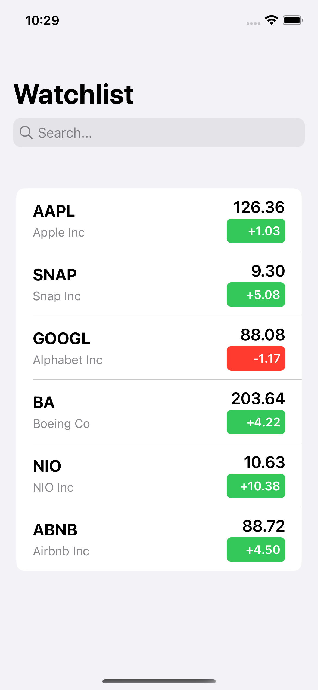
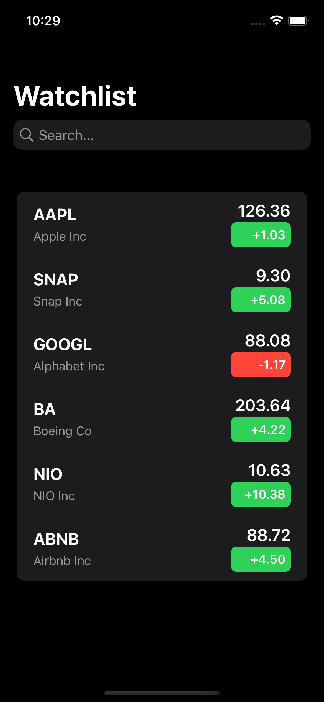

# StocksList
A stocks app that displays price and percentage changes

### What's featured

- Using finnhub api for stocks profile
- Using marketaux api for stocks news
- Clean architecture and MVVM, where the project is divided into layers that follow the dependecy rules.
    - Data Layer - for getting data from APIClient and CoreData and using an interactor to handle data request/access from datasources. 
    - Domain Layer - for the entities/models of stocks, it doesnt know anything about any other layer and they are the least likely to change when something external changes.
    - Presentation Layer - for the ViewModel and Views, brings together the domain entities and interaction with data layer
- Async/await with good usage of structured concurency and Task closures
- SwiftUI 
    - Searchbar with search functionality
    - List with rows of each stock
- CoreData for persistence
- Unit tests, available these throughout each module

### Screenshots

